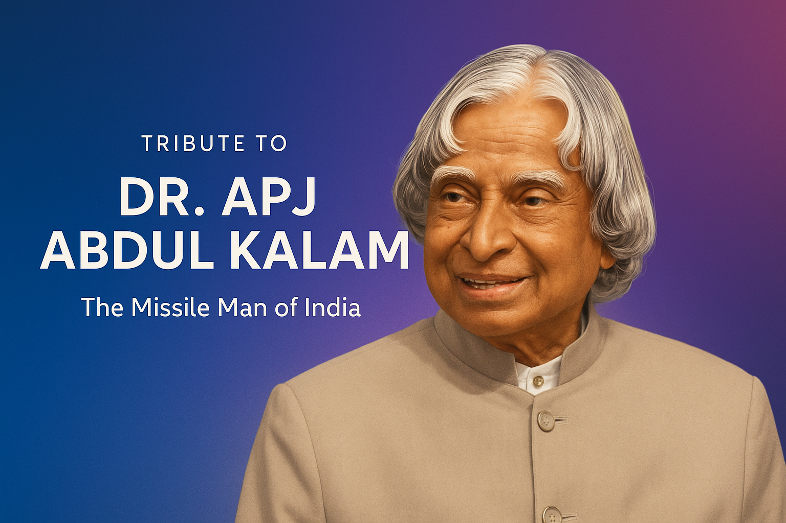

# Tribute to Dr. APJ Abdul Kalam



[](LICENSE) [](#) [](#) [](#)

A clean, responsive single-page tribute to **Dr. APJ Abdul Kalam** built with simple HTML/CSS (Tailwind utilities) and a tiny JS layer to make the page editable via a config or the included `element_sdk`. Designed to be easy to customize, fast to load, and visually appealing.

---

## **✨ Highlights**
- Modern, readable layout that works on desktop and mobile
- Replaceable portrait (SVG or raster) — instructions included
- Theme and text configurable via `defaultConfig` in `index.html`
- Accessible markup and semantic headings for good SEO/UX

---

## **🔎 Live preview**
Open `index.html` in your browser or serve locally:

```bash
# quick static server (recommended)
python -m http.server 8000
# then open http://localhost:8000

```
---

## **🧭 Project contents**

my-tribute-project/
├─ README.md
└─ assets/
   ├─ banner.png
   └─ apj-abdul-kalam.jpg

---

## **🖼 How to change the portrait (fast)**

Option A — use a photo (easy)

Put the file in assets/ (e.g. assets/kalam.jpg).
```sh

```

Option B — use an external SVG (vector)
Save assets/kalam.svg and use:
```html

```
Option C — paste new inline SVG
```sh
Drop your new <svg>...</svg> where the existing SVG is. Keep viewBox, width & height.
```
---

## **⚙️ Customize text & theme**

Open index.html and edit the defaultConfig object near the bottom. Example keys:
```js
defaultConfig = {
  page_title, subtitle, intro_text, quote_text, footer_text,
  background_color, accent_color, secondary_accent,
  font_family, font_size
}
```
If element_sdk runs in your environment, changes can be pushed dynamically via elementSdk.setConfig(...).

---

## **🧩 Small polish tips (optional)**

Compress assets/* to WebP for faster loads.

Replace banner.png with a banner sized ~1200×360 for that hero look.

For production remove the Tailwind CDN and compile a small custom stylesheet.

## **🚀 Deploy**

GitHub Pages: push to main or gh-pages and enable Pages in repo settings.

Any static host (Netlify, Vercel, Surge) will work—just point to the project folder.

## **🤝 Contributing**

Small edits welcome. Fix typos, swap the portrait, or open an issue for feature ideas.

## **📝 License**

MIT — see LICENSE.
